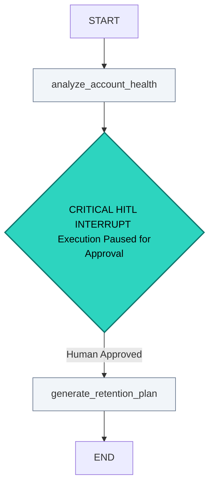

# Enterprise Customer Success Agentic Framework (`LangGraph`)

## 🌐 Executive Summary
An enterprise-grade customer success pipeline built on LangGraph to automate customer churn analysis. The system analyzes customer accounts, detects churn risks, and drafts retention plans. To prevent compliance errors, the engine contains a hard programmatic boundary that halts execution until an account director reviews the strategy.

## 🏗️ System Architecture & Workflow Graph
The system is modeled as a stateful, cyclic execution graph. Below is the workflow layout mapping the automated evaluation steps and the explicit checkpoint interruption gateway:

```text
       +-------------------------------+

       |             START             |
       +-------------------------------+
                       │
                       ▼
       +-------------------------------+

       |    analyze_account_health     |  <-- Tracks account engagement vectors
       +-------------------------------+
                       │
                       ▼
    =======================================
    ||      CRITICAL HITL INTERRUPT      ||  <-- State serialized via InMemorySaver
    ||  (Execution Paused for Approval)  ||  <-- Human intervention checkpoint
    =======================================
                       │
                       ▼
       +-------------------------------+

       |    generate_retention_plan    |  <-- Node executes only AFTER approval
       +-------------------------------+
                       │
                       ▼
       +-------------------------------+

       |              END              |
       +-------------------------------+
```

---

## 🔧 Operational & Technical Architecture Design

### 1. Stateful Ledger Management
The architecture operates around a unified `CustomerSuccessState` transaction payload. Unlike fragile, stateless prompt sequences, this configuration tracking ensures that data changes across your nodes are traceable, verifiable, and protected against data mutation risks:
* **`ticket_id`**: Centralized logging key for tracking transaction paths.
* **`client_sentiment`**: Automated classification marker driving routing conditions.
* **`suggested_retention_plan`**: Staging string variable for the AI-generated recovery strategy.
* **`human_approved`**: Boolean gate parameter validated before finishing graph loops.

### 2. Durable Checkpointing & Human-in-the-Loop (HITL) Guardrails
To protect the system from producing unverified communication updates, we integrate LangGraph's native compilation checkpoints:
* **The Interruption Engine**: Using the compile configuration statement `interrupt_before=["generate_retention_plan"]`, the system executes an automated freeze pattern right before any strategic responses are formulated.
* **State Serialization Layer**: The `InMemorySaver` checkpointer serializes all memory vectors, tokens, and logic markers. The system can safely wait in an idle state for hours or days until an operational stakeholder passes a manual adjustment event.
* **Risk Avoidance Value**: This blueprint signals a move away from full system autonomy, prioritizing compliance safety, risk mitigation, and corporate governance for enterprise operations.

---

## 🚀 Deployment Execution Flow

### Local System Walkthrough
To run the orchestration framework locally and view the programmatic state checkpoints, execute the driver layout file:

```bash
# Clone the enterprise customer success framework repository
git clone https://github.com

# Move into the working script directory
cd enterprise-cs-agent-framework

# Execute the LangGraph engine script
python app.py
```

### Verification Logs Output
When initialized, your terminal logs verify the execution graph structure and display the programmatic state pause event:

```text
[System] Initializing LangGraph Engine...
[System] Persistent checkpoint registry connected.
[Node] Running 'analyze_account_health'...
[Node] Tracking account telemetry logs and CRM data signals...
[Status] Churn risk indicators isolated. Approaching next node execution path...

## 🏗️ System Architecture & Workflow Graph




=== [SYSTEM INTERRUPT TRIGGERED] ===
The LangGraph execution instance has safely paused.
Current Application State Payload has been serialized to the Checkpointer.
Reason: Human-in-the-Loop approval is required prior to executing 'generate_retention_plan'.
====================================
```
